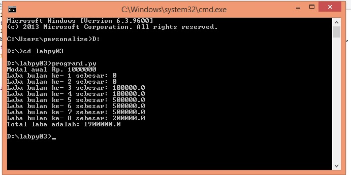

Penjelasan latihan1

1.	Diminta memasukan nilai input untuk N, banyak nya data yang akan di tampilkan berdasarkan input yang dimasukkan.Anda bisa memasukan nilai input N berapa saja.
2.	Akan muncul nilai 1 s/d N, yang merupakan perulangan penambahan dari 0+1.
3.	Dengan menggunakan fungsi random.Yaitu, program akan menampikan angka dibawah 0.5 secara acak.
4.	Ketika sudah memberikan input nilai,maka akan langsung muncul data nilai random.
Hasil Screenshot:

Penjelasan latihan2

1. Masukkan input bilangan.
2. Program akan terus mengulang untuk meminta memasukkan bilangan, hinggan program berhenti ketika memasukan angka 0 (nol).
3. Program akan mencari bilangan terbesar dari beberapa bilangan yang anda inputkan.
4. Lalu akan ditampilkan bilangan terbesar dari semua bilangan yang di input.
Hasil Screenshot:

Penjelasan program1

1. Modal awal pengusaha sebesar 100000000
2. Untuk menghitung laba perbulan maka diinputkan besarnya presentase keuntungan perbulan, yakni:
3. Bulan pertama 0% (belum mendapat laba)
4. Bulan ketiga 1%
5. Bulan kelima 5%
6. Bulan kelima 3%
7. Selanjutnya, hasil laba dari bulan perbulan akan ditampilkan.
8. Program akan jumlahkan semua keuntungan yang didapat.
9. Maka akan ditampilkan total laba yang didapat.
Hasil Screenshot:
